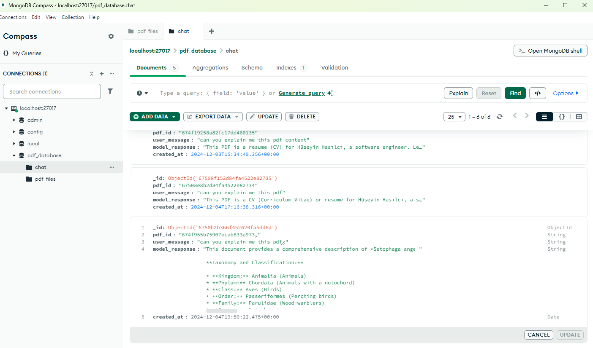
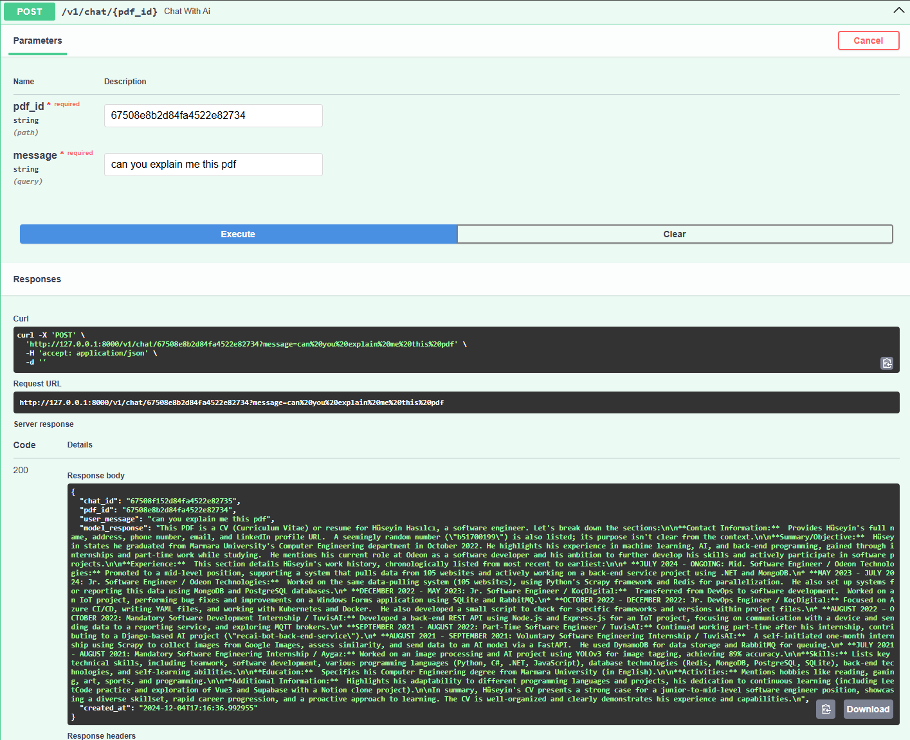
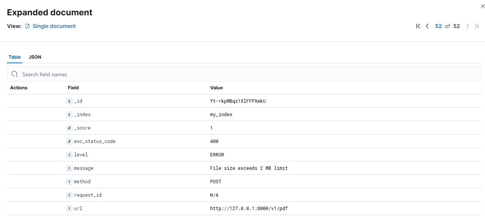
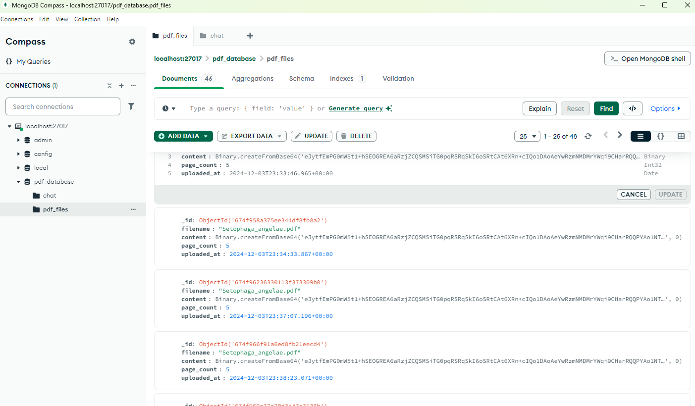
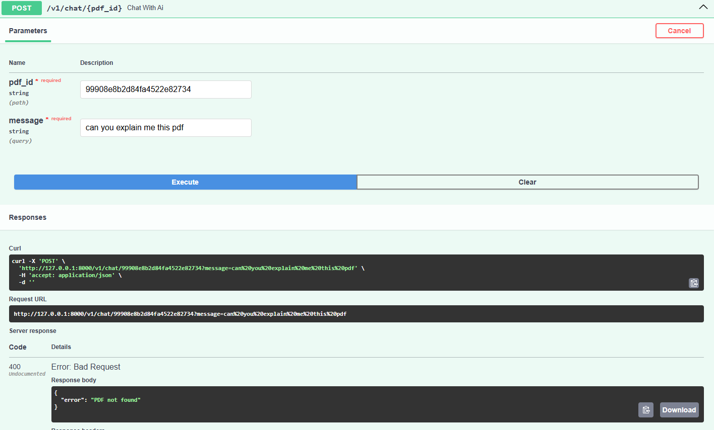
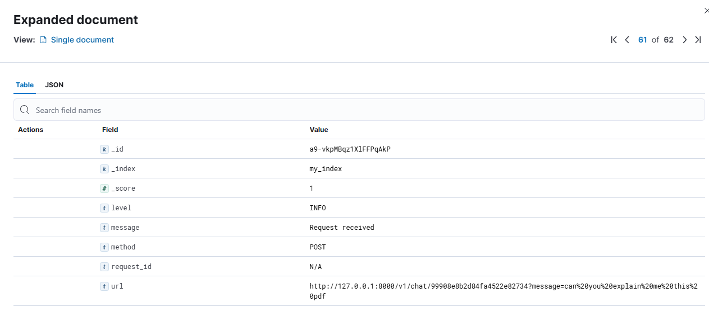
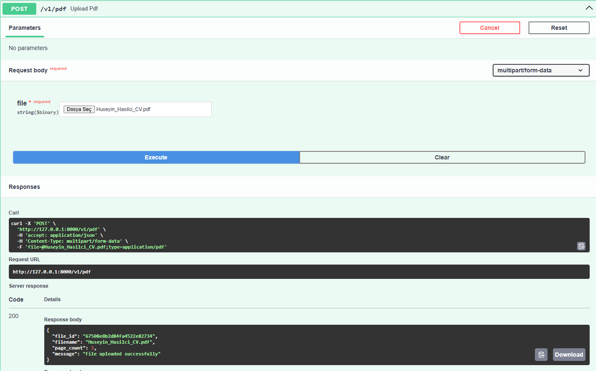

# Pdf Chat Api Docs

Proje içerisinde kullanılan teknolojiler:
1. MongoDB -> Verilerin tutulması için veritabanı
2. ElasticSearch -> Log verilerinin tutulması için yüksek performanslı araç
3. Kibana -> Elasticsearch üzerinden basılan logları göstermek için kullanılan arayüz. [Kibana](http://localhost:5601/app/discover#/ "Kibana Ui").

Başlangıç olarak **.env** dosyası oluşturuyoruz ve içerisini şu şekilde dolduruyoruz:
>GEMINI_API_KEY=YOUR GEMINI API KEY
>
>DATABASE_URL=mongodb://localhost:27017
> 
>DATABASE_NAME = pdf_database
> 
>COLLECTION_NAME = pdf_files # buradaki sadece collection için örnektir.

Projenin bağımlılıklarını yükleyerek başlıyoruz:
>pip install -r requirements.txt

Daha sonra docker üzerinden local kurulumları yapabiliriz:
> 1. Elastic Eklenmesi
> 
>    1. docker pull docker.elastic.co/elasticsearch/elasticsearch:8.10.2
>    2. docker run -d --name elasticsearch -p 9200:9200 -p 9300:9300 -e "discovery.type=single-node" -e "xpack.security.enabled=false" docker.elastic.co/elasticsearch/elasticsearch:8.10.2
> 
> 2. Kibana Eklentisi
>    1. docker pull docker.elastic.co/kibana/kibana:8.10.2
>    2. docker run -d --name kibana -p 5601:5601 --link elasticsearch:elasticsearch docker.elastic.co/kibana/kibana:8.10.2
> 
>  3. MongoDB Eklentisi
>     1. docker pull mongodb/mongodb-community-server:latest
>     2. docker run --name mongodb -p 27017:27017 -d mongodb/mongodb-community-server:latest

En son projeyi başlatabiliriz:
> Konsola **fastapi dev** yazarak projeyi başlatabiliriz.
> 
> Ardından [Swagger](http://127.0.0.1:8000/docs#/ "Projenin api dokümanı") swgger'a ulaşıp test edebilirsiniz.

Ayrıca test dosyalarını çalıştırmak için aşağıdaki kodu konsola yapıştırabiliriz
> pytest

Projeye Ait Görseller
#### Database Chat Table

#### Api Chat Response

#### Error Log Elastic And Kibana

#### Uploaded PDFs

#### PDF not Found Api Response

#### Request Received Log Elastic And Kibana

#### Uploading PDF With API

